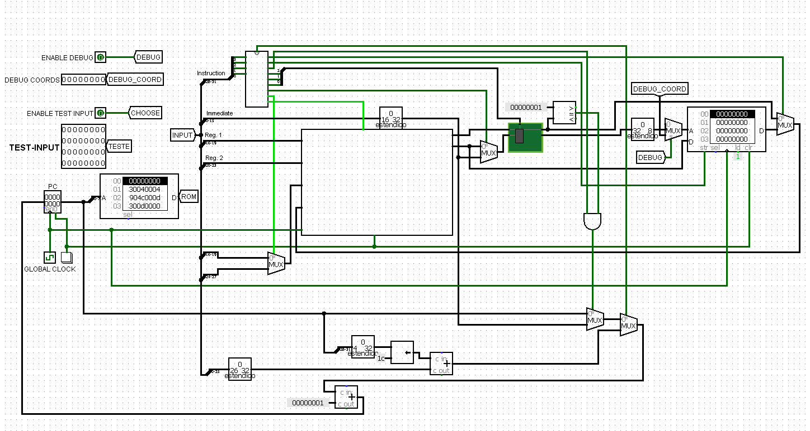
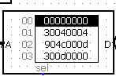
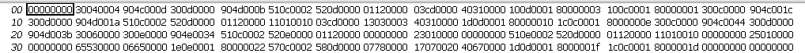
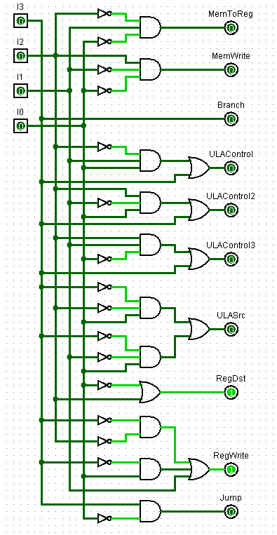

# glips-Processador MIPS de Um Ciclo para Multiplicação de Matrizes 4x4
## Sumário
- [Descrição](#descrição)
- [Funcionalidades](#funcionalidades)
  - [Multiplicação de Matrizes 4x4](#multiplicação-de-matrizes-4x4)
  - [Instruções MIPS Simplificadas](#instruções-mips-simplificadas)
  - [Execução em Um Ciclo](#execução-em-um-ciclo)
- [Seções do Circuito](#seções-do-circuito)
  - [Main](#main)
  - [Memória de Instrução](#memória-de-instrução)
  - [Unidade de Controle](#unidade-de-controle)
  - [Banco de Registradores](#banco-de-registradores)
  - [ULA](#ula)
  - [Memória de Dados](#memória-de-dados)
- [Instrução em Assembler MIPS](#instrução-em-assembler-mips)
- [Contribuições](#contribuições)


## Descrição
Este é um simulador de processador MIPS de um ciclo implementado no software Logisim, capaz de realizar a multiplicação de matrizes 4x4. Neste projeto, todas as instruções foram criadas pelos integrantes da equipe e são de 32 bits, e o processador executa cada instrução em um único ciclo.


## Funcionalidades:

  ### Multiplicação de Matrizes 4x4:
  O processador recebe duas matrizes 4x4 como entrada, multiplica linhas por colunas e produz a matriz resultante também 4x4 como saída.

  ### Instruções MIPS Simplificadas: 
  Implementa um conjunto simplificado de instruções MIPS, incluindo instruções de carregamento e armazenamento de memória, operações aritméticas e de controle de fluxo.

  ### Execução em Um Ciclo:
  Cada instrução é executada em um único ciclo de clock, simplificando a arquitetura do processador.

## Seções do Circuito

  ### Main
  No main ocorre a implementação de todo o circuito do processador.
  

  ### Memória de Instrução
  Na memória de instrução, foram colocadas todas as instruções criadas pelos colaboradores em hexadecimal após traduzirem do assembler.
  Ela manda as instruções para o Banco de Registradores, a ULA e a Unidade de Controle.
  
  

  Códigos da Memória de Instrução:

  

  ### Unidade de Controle
  A Unidade de Controle foi estabelecida por meio de um circuito formado a partir de uma tabela verdade. 
  Ela é responsável por receber as instruções da memória de instrução e mandar os sinais certos ao resto do processador para executá-las.

  
  
  ### Banco de Registradores.
  O Banco de Registradores foi criado com o uso de 16 registradores de 32 bits, 2 multiplexadores e 1 demultiplexador.
  Como o próprio nome diz, é nele que todos os registradores utilizados na implementação desse trabalho estão guardados.

  ![bancodere

  ### ULA 
  A ULA é a parte do circuito responsável por realizar os cálculos do processador.
  Nela serão realizadas operações de adição, multiplicação, deslocação de bits e comparação.

  ### Memória de Dados
  Na Memória de Dados é armazemado os resultados das operações realizadas na ULA, as matrizes formadas para serem multiplicadas e a matriz resultaante da multiplicação. 

## Instrução em Assembler MIPS
A instrução a seguir foi criada e traduzida para a realização desse projeto. 
Ela realiza a criação das matrizes-base, utilizadas para a criação da terceira matriz, e a criação da terceira matriz por meio das operações.

```
li $s3, 0
li $t3, 4
  beq $t3, $s3, 13
  li $s4, 0
    beq $t3, $s4, 11
    sll $t0, $s3, 2
    sll $t1, $s4, 0
    add $t0, $t0, $t1
    add $t2, $s3, $s4
    sw $t2, ($t0)
    addi $s4, $s4, 1
    j 3
  addi $s3, $s3, 1
  j 1
li $s3, 0
  beq $t3, $s3, 28
  li $s4, 0
    beq $t3, $s4, 26
    sll $t0, $s3, 2
    sll $t1, $s4, 0
    add $t0, $t0, $t1
    addi $t0, $t0, 16
    add $t2, $s3, $s4
    addi $t2, $t2, 3
    sw $t2, ($t0)
    addi $s4, $s4, 1
    j 16
  addi $s3, $s3, 1
  j 14
li $s3, 0
  beq $t3, $s3, 68
  li $s4, 0
    beq $t3, $s4, 59
    li $t5, 0
    li $s5, 0
    beq $t3, $s5, 52
    sll $t0, $s3, 2
    sll $t1, $s5, 0
    add $t0, $t0, $t1
    lw $t2, ($t0)
    sll $t0, $s5, 2
    sll $t1, $s4, 0
    addi $t0, $t0, 16
    lw $t4, ($t0)
    mul $t4, $t4, $t2
    add $t5, $t5, $t4
    addi $s5, $s5, 1
    j 34
  sll $t6, $s3, 2
  sll $t7, $s4, 0
  add $t6, $t6, $t7
  addi $t6, $t6, 32
  sw $t5, ($t6)
  addi $s4, $s4, 1
  j 31
addi $s3, $s3, 1
j 29
```
Código traduzido para hexadecimal:
```
v2.0 raw
0 30040004 904c000d 300d0000 904d000b 510c0002 520d0000 1120000
3cd0000 40310000 100d0001 80000003 100c0001 80000001 300c0000 904c001c
300d0000 904d001a 510c0002 520d0000 1120000 11010010 3cd0000 13030003
40310000 1d0d0001 80000010 1c0c0001 8000000e 300c0000 904c0044 300d0000
904d003b 30060000 300e0000 904e0034 510c0002 520e0000 1120000 0
23010000 0 510e0002 520d0000 1120000 11010010 0 25010000
0 65530000 6650000 1e0e0001 80000022 570c0002 580d0000 7780000
17070020 40670000 1d0d0001 8000001f 1c0c0001 8000001d
```
## Contribuições 
Esse projeto foi realizado por Guido Xenofonte e Luana Teles.
